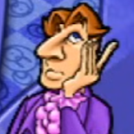
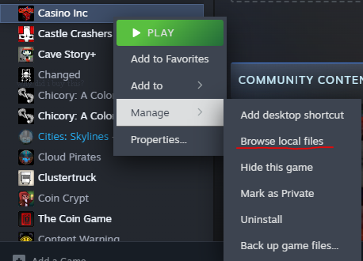
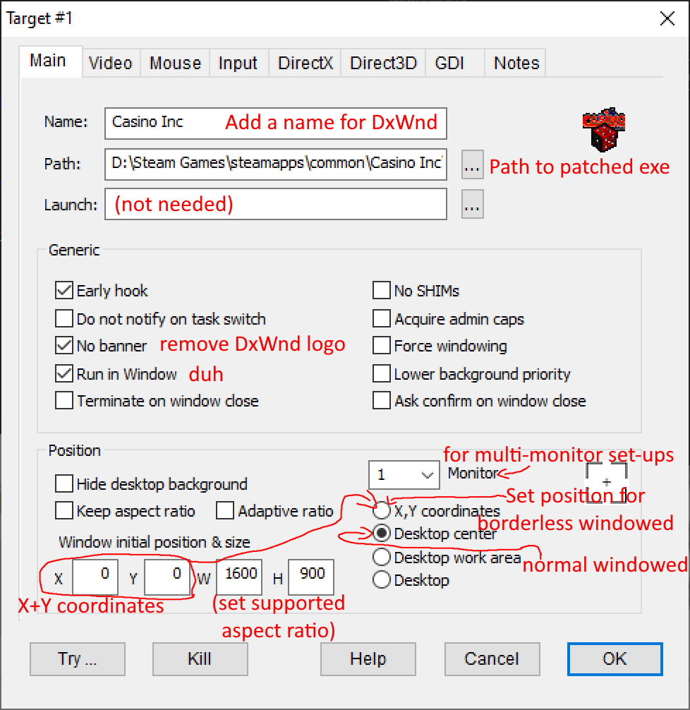
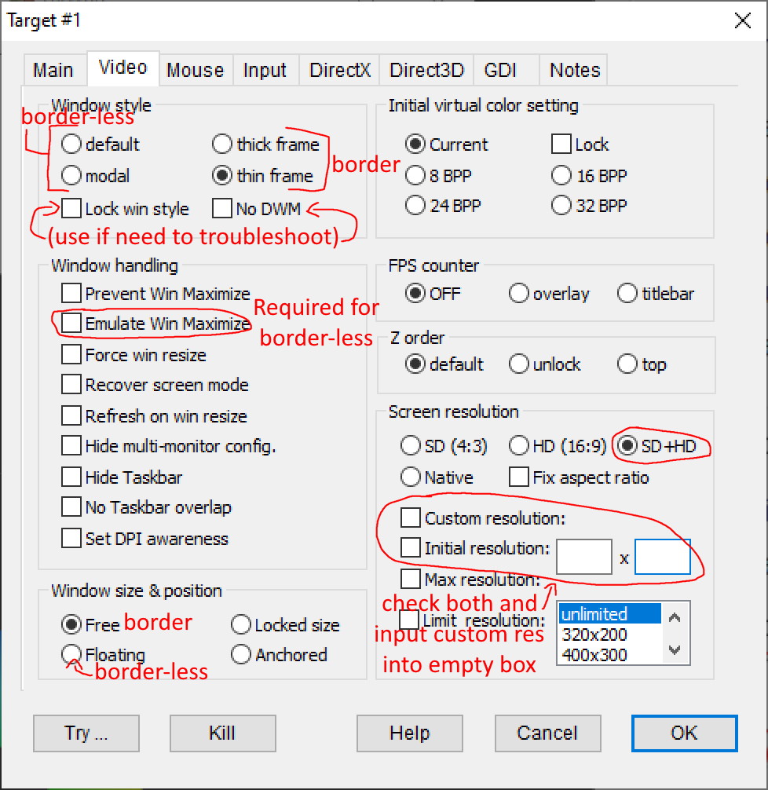

# Casino-inc-guide
This is a Steam Mirror of a guide for patching and running Casino Inc in windowed mode. This is hear because I keep running into Steam runtime error code 15 whenenver I try to save my progress, and it's really annoying. Till then, I'm posting my guide here.

# Quick Intro and Disclaimer
Casino Inc is unfortunately one of those older games that not only doesn't support windowed mode, but has bad copy protection that triggers easily even with a legit copy, and it wasn't patched out for the Steam release. This Guide will go over patching the game to remove the copy protection, fix bugs such as issues that occur at high frame rates, as well as how you can play the game in windowed mode.

This guide is based of a computer using *Windows 10*, Windows 11 and Linux users may have to change or do additional steps not listed in the guide (I don't expect Windows 11 to be any different, but I don't know what Microsoft is gonna screw up with it or Windows 12 later down the line.) I'd appreciate it if you could list anything you had to do differently in the comments so I can list it in the guide for easier finding+reading.

The Patch that I'll be sharing has been reported by some users that it can lock machines up and require a force reboot. I don't know to what extent the machines lock up, maybe the reporters didn't have task manager set to *Always stay on top*? I'm also sure if the game locks up you'll have an easier time closing the game if it's in windowed mode. Regardless, I recommend closing and/or saving anything you're working on that's important before playing Casino Inc, you don't wanna lose progress on the projects you're working on.

# Patching Casino Inc
We'll be using a community exe file to play Casino Inc rather than the official one(s)

You can download the file [here](https://www.dropbox.com/s/a2spmrdl4ufjhbl/CasinoIncFixed.zip?dl=0). The download button is near the top right of the webpage, and you do **not** need an account to download the zip folder. Here is a [mirror](https://files.catbox.moe/p6ukw7.zip) encase the Dropbox link goes down.

Once downloaded, open the zip, then open an explorer window to Casino Inc's game folder. If you do not know where Casino Inc is located, right click on the game in Steam, and under *Manage*, click *Browse local files*.

Drag and drop *CasinoExpansionFixed.exe* from the zip file into Casino Inc's game folder. Make sure not to accidentally place it into a different folder, or drag it onto of another program to tell windows to open it with that program.

If you plan on playing the game in full screen and want to see the game's intro cut-scene whenever the game opens, feel free to also drag and drop the *GameData* folder into the Casino Inc folder. Windows should automatically put the file in the right folder. However, if you wanna play in Windowed mode, don't add the *GameData* folder, because the game will freeze instead of stopping the cut-scene when in Windowed mode. If you have any issues with the cut-scene, you can delete it under *GameData* > *Movies*, then delete *Casino_Intro.bik*.

Lastly, you'll be opening the game via the *CasinoExpansionFixed.exe* file and not through Steam, as Steam will ignore the newly add file and open the game's default exe. You could however try to delete one of the other exe's, find which one steam opens, then rename the patched exe to the one Steam is using.

Now, if you're fine playing in Exclusive Fullscreen with what ever resolution the game uses and offers in the settings, you're good to go. I personally haven't had an issues alt tabbing to and from the game unlike other older fullscreen games. For me, the game was able to go up to 1440x1080, which is the 4:3 1080p equivalent, with the UI scaling 2x automatically (though the res slider in the settings for this resolution wasn't the max, set just a few notches down from the far right.)

However, if you want to play in Windowed mode, we're gonna need another tool.

# Making the game run in windowed mode
Casino Inc was never designed to run in Windowed mode, so we're gonna be using DxWnd, which hooks into the game and displays it in Windowed mode, while making the game think it's still running in fullscreen.

You can download DxWnd [here](https://sourceforge.net/projects/dxwnd/)

After downloading DxWnd, extract all the contents of the zip file where ever you want, preferably in a brand new folder. Once extracted, open dxwnd.exe. To import Casino Inc into the game, you can either drag and drop the patched exe from the game folder into the dxwnd's window, or go to *Edit* > *Add*, then in the Path section, click the three dots and navigate to the patched exe's location and select it. 

## Initial Setup

After finishing the previous step, you should be seeing a window full of tabs and options. We'll be only changing a few settings though. Feel free to view the attached images if you need a visual aid.

### Main Tab
- Type in a ***Name*** for the game, any name will do. The name+icon will appear in DxWnd's launcher.
- Checking ***No Banner*** will remove the DxWnd logo that appears on start-up. This setting isn't needed, but if you don't wanna see it, enable it.
- Setting the position to ***Desktop center*** is not needed, but recommend. If you want the game to instead appear near the top left on the screen, leave it on ***X,Y coordinates***.
- Within ***Window initial position & size***, we're gonna set the game's resolution in the W and H columns. Here is a list of valid resolutions the game states it can display at within the settings menu:

### Game Resolutions
These are the game's supported resolutions out of the box, but there are ways to make custom resolutions:
- 640x480 (4:3)
- 720x480 (3:2)
- 854x480 ~(16:9)
- 720x576 (5:4)
- 800x600 (4:3)
- 960x540 (16:9)
- 1024x576 (16:9)
- 1024x768 (4:3)
- 1280x720 (16:9)
- 1152x864 (4:3)
- 1280x800 (16:10)
- 1366x768 ~(16:9)
- 1280x960 (4:3)
- 1440x900 (16:10)
- 1280x1024 (5:4)
- 1440x960 (3:2)
- 1600x900 (16:9)
- 1400x1050 (4:3)
- 1600x1200 (4:3)
- A custom Resolution that the game likes. Please view *Custom Resolution* section for more details
The first number is what will be put in the W column, and the second number (after the X) goes into the H column.

### Video Tab
- In the video tab, set [i]Screen resolution[/i] to ***SD+HD***. This will add extra screen resolutions that game will let you choose, some of which were listed above.
- If you are using Window/DPI scaling (making text, icons and windows larger bigger than their native size, usually for screens higher than 1080p), the game window will also scale up to the % that is set in Windows settings (example: if set to 200%, a 1280x720 window will scale up to 2560x1440, though the game's internal resolution is still 720p.) Check ***Set DPI awareness*** if you want to disable this.

### If you want Borderless Windowed
- Set *Window Style* to ***Thick*** or ***Thin Frame***
- <ins>uncheck</ins> ***Emulate Win Maximize***
- Set *Window size & Position* to ***Free***

### For Windowed With Border (that you can move)
- Set *Window Style* to ***Default***
- Check ***Emulate Win Maximize***
- Set *Window size & Position* to ***Floating***

All the required settings have been set, now click OK, then within DXWnd, double click Casino Inc to open the game.

For borderless, the game should open in the resolution and position you chose. For Standard Windowed, the game will hug the top left corner at a smaller resolution, but dragging the window around should fix it and set the resolution correctly. Do note that the menu runs at 640x480 no matter what, and while it should scale up to the resolution set in DxWnd, the scaling isn't pretty. Before starting a new game however, head over to the options, and make sure the *Game Resolution* slider is set to the resolution you set the game to in DxWnd.

Here is what the game looks like running at 1280x960 on a 1920x1080 desktop:

NOTE: There is a minor bug where Casino inc might initially appear in front of everything even after tabbing out. I find that Clicking out of the game, clicking back in, then alt tabbing to something else solves this issue. You might also wanna disable Inside and City Mouse Scrolling in the game settings if you find it interfears when playing the game.

If everything is the way you'd like it, great! You're finished and can play Casino Inc just fine now. Make sure to open the game through DxWnd instead of Steam though.
If not though, there's more we can do. You can change the game's DxWnd settings anytime by right clicking on the game in DxWnd, and clicking *modify...*

### For setting position of borderless windowed
Given that the window is borderless, you're stuck with where the game is located and can't move it. You'll have to change the X and Y coordinates in the *Main* > *Position* section, and also make sure *X,Y Coordinates* setting is set. By default, X and Y are set to 50, meaning they're 50 pixels right and down from the top corner of the screen. If you want the game to be at the top left corner, set them to 0,0. If you're not sure what coordinats to put the game, it's best to take a screenshot of your whole desktop and use a paint/image editor program that shows the coordinates of where your mouse is. That exact position of where your mouse at is the coordinate where the top left game window corner will stick to.

If You want a custom resolution, read the next section.

# Custom Resolution
There is one very important rule when using Custom Resolution: ***Any resolution higher than the game's highest built in resolution for a given aspect ratio won't work***
This means the game can't render any higher than 1600x900 for 16:9 ratios, and no more than 1600x1200 for 4:3. This unfortuantly means 1920x1080 is not valid, as it's a 16:9 ratio higher than 1600x900. However the 4:3 equivalent of 1080p, 1440x1080, isn't higher than 1600x1200, so it is valid (though the taskbar will be in the way if it's on the top or bottom of your screen.)
If you want to scale the game window any higher, you'll have to mess with Windows's DPI scaling.
For this example, I'll be trying to get the game to run @ 1384x1038, which is a 4:3 borderless resolution that fits nearly my whole 1920x1080 screen height wise, while also not overlapping with my taskbar.
Within Casino Inc's DxWnd setting menu, head over to *Position* and set *W* and *H* to the custom resolution you want (W=1384, H=1038).
Then under the *Video* tab and *Screen Resolution*, check both ***Custom resoltuion:*** and ***Initial resolution***, then set the resolution in the empty boxes (1384x1038)
Click OK, then open Casino Inc. Go to the options and make sure you can set the resolution to the custom values you put in.

Preview of gaming running at 1384x1038 on my 1920x1080 desktop:

### "Can I get the Window to display in a different resolution, even if the game doesn't support it?"
Yes, however this will cause scaling issues. DxWnd uses Nearest Neighbor for scaling, meaning that a full pixel will eaither be duplicated or not depending on the screen resolution set. This scaling method looks bad if the scale amount isn't a full number (x2, x3, etc.), making the picture look like a combination of blurry and pixilated. I haven't been successful in getting DxWnd to use a different scaling method, even if the DirectX settings seems like you should be able to do that. If you don't mind though, you can get the game window to any resoltuion.
